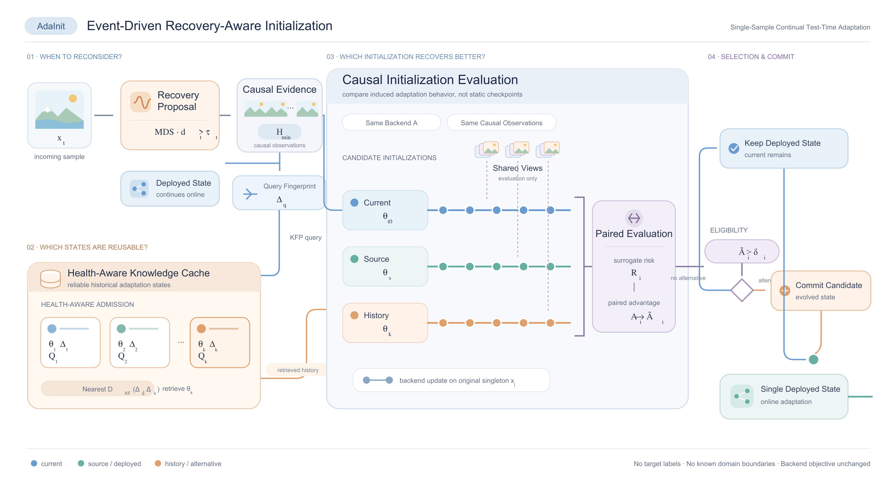

# AdaInit: Recovery-Aware Initialization for Continual Test-Time Adaptation

AdaInit is an event-driven initialization controller for single-sample continual test-time adaptation (CTTA). It detects recovery opportunities from the unlabeled input stream, retrieves reusable source or historical states, evaluates candidate initializations causally, and commits one hard initialization while keeping a single deployed model.

<p align="center">
  
</p>

This release is intentionally limited to the final experimental code used for:

- ViT-B/16 (`vit_base_patch16_224`) on ImageNet-C;
- replay CTTA and gradual CTTA;
- AdaInit with the NCTTA backend;
- the `no_adaptation`, Tent, SAR, SAR2, CoTTA, NCTTA, COME, and AdaDEM baselines.

Datasets, pretrained weights, logs, checkpoints, plots, notebooks, and earlier experiment variants are not included.

## Installation

The reference environment uses Python 3.10 and CUDA-capable PyTorch 2.2.2.

```bash
git clone https://github.com/jiangning0012/AdaInit.git
cd AdaInit

conda create -n adainit python=3.10 -y
conda activate adainit
pip install -r requirements.txt
```

The first run downloads the public ImageNet-pretrained ViT-B/16 weights through `timm`. If the machine is offline, populate the standard PyTorch/timm cache beforehand.

## Dataset

Download and extract ImageNet-C before running an experiment. `DATA_ROOT` must point to the directory containing `ILSVRC`:

```text
${DATA_ROOT}/
└── ILSVRC/
    └── imagenet-c/
        ├── gaussian_noise/
        │   ├── 1/<class folders>/<images>
        │   ├── ...
        │   └── 5/<class folders>/<images>
        ├── shot_noise/
        └── ...
```

All 15 standard ImageNet-C corruptions and severities 1–5 are required for the full protocols. Clean ImageNet is not required. The repository ignores `data/`, so a local symlink is also safe:

```bash
ln -s /absolute/path/to/data ./data
```

Either set `DATA_ROOT=/absolute/path/to/data` or use the default `./data` location.

## Running experiments

Both scripts use the interface:

```bash
./scripts/run_<protocol>.sh METHOD DEVICE SEED [additional run_exp.py arguments]
```

`METHOD` can be `adainit`, `no_adaptation`, `tent`, `sar`, `sar2`, `cotta`, `nctta`, `come`, `adadem`, or `all`.

### Replay CTTA

The replay stream samples 5,000 aligned images from every severity-5 corruption, splits them into five disjoint 1,000-image visits, and uses round-major order (15 corruptions per visit).

```bash
DATA_ROOT=/path/to/data ./scripts/run_replay.sh adainit cuda:0 2022
DATA_ROOT=/path/to/data ./scripts/run_replay.sh tent cuda:0 2022
DATA_ROOT=/path/to/data ./scripts/run_replay.sh all cuda:0 2022
```

### Gradual CTTA

For each of the 15 corruptions, severity follows `1 → 2 → 3 → 4 → 5 → 4 → 3 → 2 → 1`. The full stream therefore contains 135 contiguous segments and 135,000 evaluated images.

```bash
DATA_ROOT=/path/to/data ./scripts/run_gradual.sh adainit cuda:0 2022
DATA_ROOT=/path/to/data ./scripts/run_gradual.sh cotta cuda:0 2022
DATA_ROOT=/path/to/data ./scripts/run_gradual.sh all cuda:0 2022
```

AdaInit is never reset at benchmark segment boundaries and receives no boundary indicator. By default, baselines are reset to their source model and initial method state at every known boundary. To run a continuous no-reset baseline comparison:

```bash
BOUNDARY_RESET=false DATA_ROOT=/path/to/data \
  ./scripts/run_gradual.sh tent cuda:0 2022
```

### Smoke checks

Print the complete command without loading a model or dataset:

```bash
DRY_RUN=1 ./scripts/run_replay.sh adainit cuda:0 2022
DRY_RUN=1 CORRUPTION=gaussian_noise GRADUAL_SEVERITIES='1 2' \
  ./scripts/run_gradual.sh tent cuda:0 2022
```

Useful environment overrides are:

| Variable | Default | Meaning |
| --- | --- | --- |
| `ADAINIT_PYTHON` | `python` | Python executable for the environment |
| `DATA_ROOT` | `<repo>/data` | Dataset root containing `ILSVRC/imagenet-c` |
| `NUM_CPUS` | `4` | DataLoader workers |
| `DETAIL_SAMPLES` | `100` | Detailed JSONL prefix per segment; `0` disables it |
| `RUN_TAG` | `paper` | Name embedded in the output path |
| `LR` | `3.125e-5` | Adaptation learning rate |
| `BOUNDARY_RESET` | `true` | Reset baselines at known boundaries |

The scripts additionally expose small-stream controls (`REPLAY_VISITS`, `SAMPLES_PER_VISIT`, `SAMPLES_PER_DOMAIN`, `CORRUPTION`, and `GRADUAL_SEVERITIES`) for local verification. Their defaults reproduce the released protocols.

## Outputs and recovery

Runs are written under:

```text
logs/vit_base_patch16_224/<protocol>/<method>/<tag>/<timestamped run>/
```

The main summary is `performance.json`; crash-safe structured events are appended to `log.jsonl`, materialized as `log-1.json` after successful completion, and readable messages are stored in `log.txt`. AdaInit periodically writes resumable `ctta_checkpoint_domain_*.pt` files and a `latest_checkpoint.json` marker. Resume by appending either a checkpoint file or its run directory:

```bash
DATA_ROOT=/path/to/data ./scripts/run_replay.sh adainit cuda:0 2022 \
  --resume_checkpoint /path/to/previous/run
```

Sampling is deterministic for a fixed seed. In replay CTTA, the same source-image partition is used across corruptions, and every sampled corrupted image is evaluated exactly once.

## Code structure

```text
scripts/                         # the two released protocol entry points
ttab/model_adaptation/adainit.py # controller and causal candidate evaluation
ttab/model_adaptation/
  adainit_components.py          # detector, signatures, cache, fingerprints
  adainit_backends.py            # wrapped update rules
ttab/model_adaptation/*.py       # included baselines
ttab/loads/                      # ViT and ImageNet-C construction
ttab/benchmark.py                # continual stream evaluation and recovery
```

## Acknowledgment

This codebase builds on [TTAB](https://github.com/LINs-lab/ttab). Baseline implementations retain links to their original papers and repositories in the corresponding source files. See `NOTICE` for attribution.

## License

Released under the Apache License 2.0. See [LICENSE](LICENSE).
